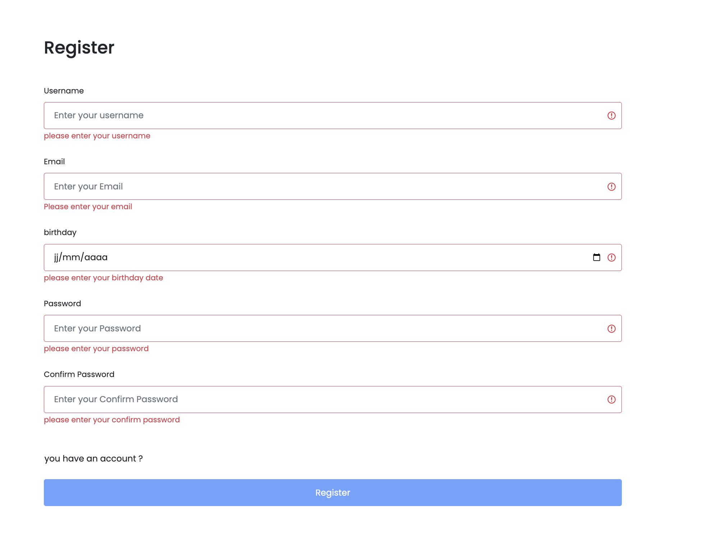
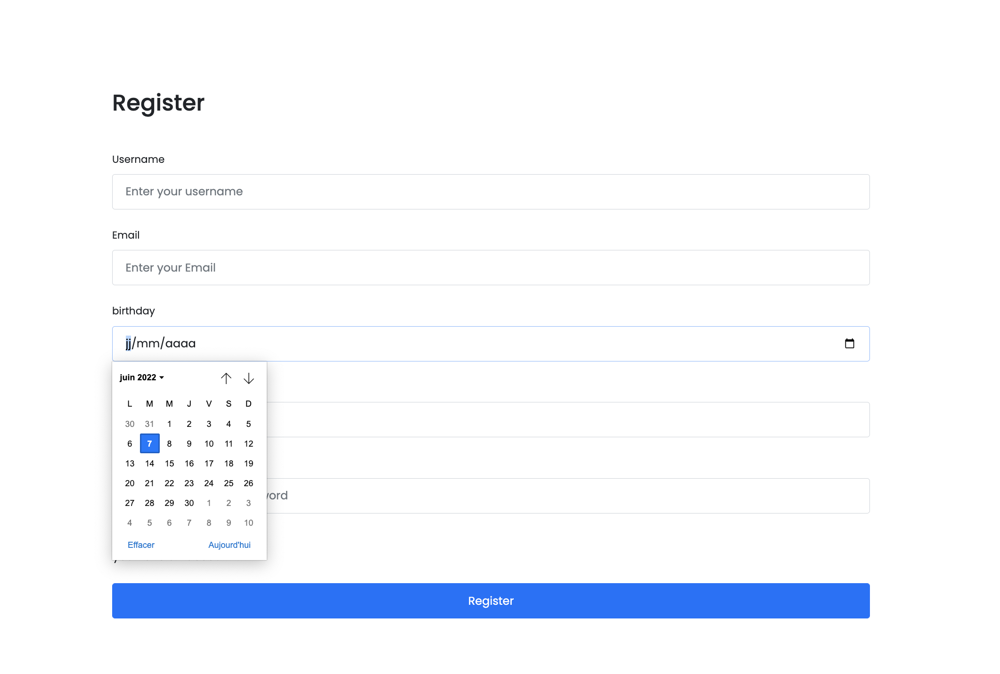

# User Panel Usgin React ✨🔥

a few days ago I decided to do this project for myself as practice.This user panel created by react js and I used Formik and Yup for easier input validation 🙂🎈 and I just wanted to focus on logic so I used react bootstrap to design the whole pages.
## Screen shot







## Built With

- React.js
- @redux/toolkit
- react-router-dom
- [REST COUNTRIES API](https://restcountries.com/)
- CSS Modules

## Additional Used

- Jest
- Linters
- Gitflow
- npm
### Run project

```bash
$ npm install
$ npm run start
```

### Run tests

To run the test just use the following command!

```bash
$ npm run test
```

## Authors

👤 **DIALLO MAMADU SAMBA**

- GitHub: [@sambabhouria](https://github.com/sambabhouria)

## 🤝 Contributing

## Show your support

Give a ⭐️ if you like this project!

## 📝 License

This project is [DMS](./licence.md) licensed.
